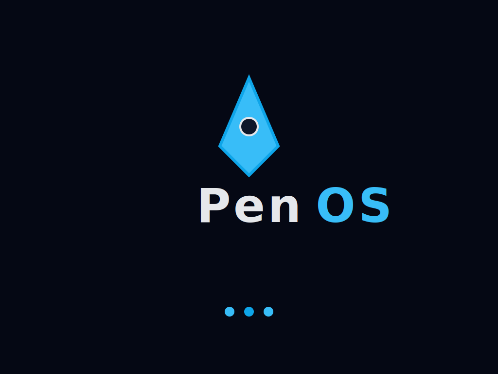

#  PenOS

**A 32-bit x86 operating system built from scratch** featuring User Mode (Ring 3) execution, VirtIO drivers, AHCI/SATA support, and a modern shell with tab completion.



## 🎯 Overview

PenOS is a operating system that demonstrates low-level systems programming mastery. It boots via GRUB, shows a graphical splash screen, and provides an interactive shell with filesystem access, multitasking, and hardware I/O—all running on bare metal or in QEMU/VirtualBox.

## 🚀 Quick Start

**Requirements:** `gcc` (32-bit support), `ld`, `grub-mkrescue`, `xorriso`, `qemu-system-i386` in windows
or you can boot from iso mounted on a disk or pendrive.

```bash
wsl -d ubuntu
make clean      # Build kernel
make iso        # Create bootable ISO
make run        # Boot in QEMU
```

**Shell commands:** `help`, `clear`, `echo`, `ticks`, `sysinfo`, `ps`, `spawn <counter|spinner>`, `kill <pid>`, `usermode`, `pwd`, `cd`, `ls`, `cat`, `satastatus`, `satarescan`, `mouse`, `shutdown`

**Tab completion:** Press `TAB` to autocomplete commands and file paths (e.g., `cd /mnt<TAB>`)

## 🛠️ Tech Stack

### Core Architecture
| Component | Technology | Details |
|-----------|-----------|---------|
| **Bootloader** | GRUB Multiboot | Themed 1024x768 splash, framebuffer handoff |
| **CPU Mode** | x86 Protected Mode | 32-bit, flat memory model |
| **Privilege Levels** | Ring 0 (Kernel) + Ring 3 (User) | Full TSS/GDT support for user mode |
| **Build System** | GNU Make + GCC | Cross-compilation, ISO generation |
| **Emulation** | QEMU, VirtualBox, VMware | Real hardware compatible |

### Memory Management
| Component | Implementation | Features |
|-----------|---------------|----------|
| **Physical Memory** | Bitmap allocator | 4KB page granularity |
| **Virtual Memory** | Higher-half paging | Recursive mapping, identity mapping |
| **Heap** | Freelist allocator | Dynamic allocation, coalescing, trimming |
| **Page Size** | 4KB | Standard x86 paging |

### Drivers & Hardware
| Driver | Type | Features |
|--------|------|----------|
| **PS/2 Keyboard** | Legacy | Buffered input, control codes |
| **PS/2 Mouse** | Legacy | Position tracking, button states |
| **VirtIO-Input** | Paravirtualized | Keyboard & mouse (QEMU) |
| **VirtIO-Console** | Paravirtualized | Serial I/O, logging |
| **VirtIO-9P** | Paravirtualized | Host filesystem access (9P2000.L) |
| **AHCI/SATA** | Modern | Hot-plug support, NCQ |
| **PCI** | Bus enumeration | Device discovery |
| **PC Speaker** | Legacy | Beep tones, startup melody |

### System Services
| Service | Implementation | Purpose |
|---------|---------------|---------|
| **Scheduler** | Preemptive Round-Robin | Timer-driven (100Hz), task lifecycle |
| **Syscalls** | `int 0x80` | `exit`, `write`, `ticks`, `yield`, `getpid` |
| **Interrupts** | IDT + PIC | 256 vectors, shared ISR stubs |
| **Timer** | PIT (8253/8254) | 100Hz tick rate |

### User Interface
| Component | Technology | Features |
|-----------|-----------|----------|
| **Framebuffer** | GRUB Multiboot | 1024x768x32, gradient splash, console overlay |
| **Console** | VGA Text Mode | 80x25, fallback support |
| **Shell** | Custom | Tab completion, path navigation, task management |

## ✨ Features

### 🎨 User Experience
| Feature | Status | Description |
|---------|--------|-------------|
| **Graphical Boot** | ✅ | Themed GRUB splash → Kernel framebuffer splash |
| **Modern Shell** | ✅ | Tab completion for commands and paths |
| **Filesystem Navigation** | ✅ | `cd`, `ls`, `pwd`, `cat` with VirtIO-9P |
| **Task Management** | ✅ | `ps`, `spawn`, `kill` with preemptive scheduling |
| **Clean Shutdown** | ✅ | ACPI power-off via `shutdown` command |

### 🔧 System Features
| Feature | Status | Description |
|---------|--------|-------------|
| **User Mode (Ring 3)** | ✅ | Full privilege separation, TSS, syscall interface |
| **Process Isolation** | ✅ | Per-process page directories, separate address spaces |
| **Multitasking** | ✅ | Preemptive round-robin, 100Hz timer |
| **Memory Protection** | ✅ | Paging, user/kernel separation, per-process isolation |
| **Hot-Plug Storage** | ✅ | AHCI SATA hot-plug detection |
| **Host Filesystem** | ✅ | VirtIO-9P (access WSL/Linux files from QEMU) |
| **Serial Console** | ✅ | VirtIO-Console for debugging |

### 💾 Storage & I/O
| Feature | Status | Description |
|---------|--------|-------------|
| **AHCI/SATA** | ✅ | Modern SATA controller, hot-plug, identify |
| **VirtIO-9P** | ✅ | 9P2000.L protocol, directory navigation |
| **PCI Enumeration** | ✅ | Device discovery, BAR mapping |
| **Keyboard Input** | ✅ | PS/2 + VirtIO, buffered, control codes |
| **Mouse Input** | ✅ | PS/2 + VirtIO, position tracking |

### 🎵 Audio & Misc
| Feature | Status | Description |
|---------|--------|-------------|
| **PC Speaker** | ✅ | Beep tones, startup melody |
| **System Info** | ✅ | `sysinfo` command, version display |
| **Branding** | ✅ | Custom splash, favicon, themed GRUB |

## 📊 Feature Map (Detailed)

| Area | What you get today | Deep-dive docs | Key sources |
| --- | --- | --- | --- |
| **Boot & CPU** | GRUB theme, `boot.s`, GDT/IDT, PIC, PIT @100Hz, TSS for Ring 3 | [`architecture.md`](docs/architecture.md#1-cpu-bring-up), [`bootstrap.md`](docs/commits/feature-core/1_bootstrap.md) | `grub/themes/penos`, `src/boot.s`, `src/arch/x86/` |
| **Memory** | Bitmap PMM, higher-half paging, recursive mapping, freelist heap, per-process page directories | [`architecture.md`](docs/architecture.md#2-memory-management), [`pmm`](docs/commits/feature-pmm/1_bitmap_pmm.md), [`paging`](docs/commits/feature-paging/1_dynamic_vmm.md), [`heap`](docs/commits/feature-heap/), [`process-isolation`](docs/commits/feature-process-isolation/commit_1_per_process_page_directories.md) | `src/mem/` |
| **Scheduler** | Preemptive round-robin, task lifecycle, zombie reaping, per-process address spaces | [`architecture.md`](docs/architecture.md#1-cpu-bring-up), [`scheduler`](docs/commits/feature-scheduler/) | `src/sched/sched.c` |
| **User Mode** | Ring 3 execution, TSS, syscall library (`exit`, `write`, `yield`, `getpid`, `ticks`), process isolation | [`usermode`](docs/commits/feature-usermode/commit_1_usermode.md), [`syscalls`](docs/commits/feature-usermode/commit_2_syscall_interface.md) | `src/arch/x86/tss.c`, `src/sys/syscall.c`, `src/lib/syscall.c` |
| **ELF Loader** | ELF32 parser, segment loading, memory mapping (foundation) | [`elf-loader`](docs/commits/feature-elf-loader/commit_1_elf_structures.md) | `src/fs/elf.c`, `include/fs/elf.h` |
| **Filesystem** | VirtIO-9P (9P2000.L), `cd`, `ls`, `pwd`, `cat`, tab completion | [`virtio-9p`](docs/commits/feature-virtio-9p-filesystem/feature-virtio-9p-filesystem.md), [`tab-completion`](docs/commits/feature-virtio-9p-filesystem/commit_2_tab-completion.md) | `src/fs/9p.c`, `src/drivers/virtio.c` |
| **Storage** | AHCI/SATA driver, hot-plug detection, identify, read/write, `satastatus`, `satarescan` | [`ahci-driver`](docs/commits/feature-ahci-sata/commit_1_driver.md), [`ahci-hotplug`](docs/commits/feature-ahci-sata/commit_2_hotplug.md) | `src/drivers/ahci.c` |
| **Drivers** | PS/2 keyboard/mouse, VirtIO-Input (keyboard/mouse), VirtIO-Console (serial), PCI, PC Speaker | [`architecture.md`](docs/architecture.md#3-devices-and-drivers), [`mouse`](docs/commits/feature-mouse/1_ps2_mouse.md), [`virtio-input`](docs/commits/feature-virtio-input/commit_1_virtio_input.md), [`virtio-mouse`](docs/commits/feature-virtio-input/commit_2_mouse.md), [`virtio-console`](docs/commits/feature-virtio-console/commit_1_serial.md), [`speaker`](docs/commits/feature-pc-speaker/) | `src/drivers/` |
| **UI** | Framebuffer splash, console overlay, VGA fallback, shell with tab completion | [`architecture.md`](docs/architecture.md#5-ui-and-shell), [`framebuffer`](docs/commits/feature-framebuffer/1_framebuffer-console.md), [`tab-completion`](docs/commits/feature-virtio-9p-filesystem/commit_2_tab-completion.md) | `src/ui/`, `src/shell/shell.c` |

## 📚 Documentation

### Getting Started
- **[Architecture Overview](docs/architecture.md)** - Best starting point, explains all subsystems
- **[README](docs/README.md)** - Documentation index
- **[VirtIO-9P Guide](docs/virtio-9p-guide.md)** - Host filesystem setup

### Feature Documentation
- **Core:** [Bootstrap](docs/commits/feature-core/1_bootstrap.md)
- **Memory:** [PMM](docs/commits/feature-pmm/1_bitmap_pmm.md), [Paging](docs/commits/feature-paging/1_dynamic_vmm.md), [Heap](docs/commits/feature-heap/)
- **Scheduler:** [Preemptive RR](docs/commits/feature-scheduler/1_preemptive_rr.md), [Task Lifecycle](docs/commits/feature-scheduler/2_task_lifecycle.md)
- **User Mode:** [Ring 3 Support](docs/commits/feature-usermode/commit_1_usermode.md), [Syscall Interface](docs/commits/feature-usermode/commit_2_syscall_interface.md)
- **Filesystem:** [VirtIO-9P](docs/commits/feature-virtio-9p-filesystem/feature-virtio-9p-filesystem.md), [Tab Completion](docs/commits/feature-virtio-9p-filesystem/commit_2_tab-completion.md)
- **Storage:** [AHCI Driver](docs/commits/feature-ahci-sata/commit_1_driver.md), [Hot-Plug](docs/commits/feature-ahci-sata/commit_2_hotplug.md)
- **Drivers:** [Mouse](docs/commits/feature-mouse/1_ps2_mouse.md), [VirtIO-Input](docs/commits/feature-virtio-input/), [VirtIO-Console](docs/commits/feature-virtio-console/commit_1_serial.md), [PC Speaker](docs/commits/feature-pc-speaker/)
- **UI:** [Framebuffer](docs/commits/feature-framebuffer/1_framebuffer-console.md), [GRUB Theme](docs/commits/feature-branding/1_grub_theme.md)

### Release History
[v0.8.0](docs/versions/v0.8.0.md) → [v0.7.0](docs/versions/v0.7.0.md) → [v0.6.0](docs/versions/v0.6.0.md) → ... → [v0.1.0](docs/versions/v0.1.0.md)

## 🎯 Project Structure

```
PenOS/
├── src/
│   ├── arch/x86/        # CPU, GDT, IDT, TSS, interrupts, timer
│   ├── mem/             # PMM, paging, heap
│   ├── sched/           # Scheduler, task management
│   ├── drivers/         # Keyboard, mouse, PCI, VirtIO, AHCI, speaker
│   ├── fs/              # 9P filesystem, VFS
│   ├── sys/             # Syscalls, power management
│   ├── lib/             # String functions, syscall wrappers
│   ├── ui/              # Framebuffer, console
│   ├── shell/           # Interactive shell
│   ├── apps/            # System info
│   ├── boot.s           # Assembly bootstrap
│   └── kernel.c         # Main entry point
├── include/             # Header files (mirrors src/)
├── grub/                # GRUB configuration, themes
├── docs/                # Architecture, commits, versions
├── Makefile             # Build system
└── linker.ld            # Linker script (higher-half)
```

## 🔮 Future Roadmap

See [`feature_roadmap.md`](https://github.com/ShaonMajumder/PenOS/blob/main/docs/feature_roadmap.md) for detailed plans.

### Planned Features
- **VirtIO-Block** - Block device driver for persistent storage
- **FAT32 Filesystem** - Read/write files
- **VirtIO-Net** - Network driver
- **TCP/IP Stack** - Networking protocols
- **ELF Loader** - Load external user programs
- **GUI Framework** - Window manager, graphics

## 🤝 Contributing

PenOS is primarily a learning and portfolio project, but contributions are welcome! Please:
1. Read the [architecture documentation](docs/architecture.md)
2. Check the [feature roadmap](docs/feature_roadmap.md)
3. Follow the existing code style
4. Document your changes

## 📄 License

This project is open source and available for educational purposes.

## 🙏 Acknowledgments

- **OSDev Wiki** - Invaluable resource for OS development
- **GRUB** - Bootloader
- **QEMU** - Emulation and testing
- **VirtIO** - Paravirtualized device specifications

---

**Built with ❤️ for learning and demonstration**
