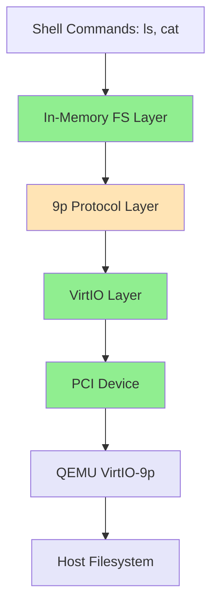

# VirtIO-9p Filesystem User Guide

This guide explains how to use the VirtIO-9p filesystem driver in PenOS to share files between your host system (WSL/Linux) and PenOS running in QEMU.

## What is VirtIO-9p?

VirtIO-9p is a paravirtualized filesystem that allows virtual machines to access directories from the host system. The 9p protocol (originally from Plan 9) provides a lightweight way to share files between the host and guest OS without needing network filesystems or disk images.

In PenOS, this means you can:
- Access files from your WSL/Linux filesystem while running PenOS in QEMU
- Test file operations without modifying disk images
- Share data easily between your development environment and PenOS

## Prerequisites

- QEMU with VirtIO support (qemu-system-i386)
- A directory on your host system to share (e.g., in WSL or Linux)
- PenOS built with VirtIO-9p support (v0.8.0+)

## Setting Up Directory Sharing

### Step 1: Prepare a Shared Directory

Create a directory on your host system with some test files:

```bash
# In WSL/Linux
mkdir -p ~/penos-shared
echo "Hello from WSL!" > ~/penos-shared/hello.txt
echo "This is a test file" > ~/penos-shared/test.txt
```

### Step 2: Launch QEMU with VirtIO-9p

Modify your QEMU command to include the VirtIO-9p device and mount tag. Add these options to your `make run` target in the Makefile:

```makefile
run: iso
	qemu-system-i386 -cdrom PenOS.iso \
		-m 128M \
		-device virtio-9p-pci,fsdev=shared,mount_tag=hostshare \
		-fsdev local,id=shared,path=/path/to/your/shared/dir,security_model=none
```

**Important parameters:**
- `-device virtio-9p-pci,fsdev=shared,mount_tag=hostshare` - Creates a VirtIO 9P PCI device
  - `mount_tag=hostshare` - The tag PenOS will use to identify this filesystem
  - `fsdev=shared` - Links to the fsdev definition
- `-fsdev local,id=shared,path=/path/to/your/shared/dir,security_model=none` - Defines the shared filesystem
  - `id=shared` - Identifier for this filesystem device
  - `path=/path/to/your/shared/dir` - Host directory to share (replace with actual path)
  - `security_model=none` - Simplest security model (suitable for development)

### Example for WSL:

If your shared directory is at `/home/shaon/penos-shared` in WSL:

```makefile
run: iso
	qemu-system-i386 -cdrom PenOS.iso \
		-m 128M \
		-device virtio-9p-pci,fsdev=shared,mount_tag=hostshare \
		-fsdev local,id=shared,path=/home/shaon/penos-shared,security_model=none
```

### Step 3: Boot PenOS

Run PenOS with the updated QEMU command:

```bash
make run
```

## Using the Filesystem in PenOS

### Current Implementation Status

> [!IMPORTANT]
> The current implementation (v0.8.0) includes the foundational infrastructure but file operations are **stub implementations**. The following commands are available but return placeholder data from an in-memory filesystem:

### Available Shell Commands

Once PenOS boots and you see the `PenOS>` prompt, you can use these filesystem commands:

#### 1. `ls` - List Files

Lists all files in the filesystem:

```
PenOS> ls
[fs] files:
  hello.txt  (17 bytes)
  test.txt  (21 bytes)
```

**Current behavior:** Shows files from the in-memory stub filesystem, not actual VirtIO-9p files yet.

#### 2. `cat <filename>` - Display File Contents

Displays the contents of a file:

```
PenOS> cat hello.txt
Hello from WSL!
```

**Current behavior:** Shows content from the in-memory stub filesystem.

**Error handling:**
```
PenOS> cat nonexistent.txt
[fs] file not found: nonexistent.txt
```

### What's Implemented

✅ **Infrastructure Layer:**
- PCI device enumeration and discovery
- VirtIO device initialization and feature negotiation
- Virtqueue management (descriptor table, available ring, used ring)
- VirtIO-9p device detection
- 9p protocol version handshake (Tversion/Rversion)
- Filesystem attach operation (Tattach/Rattach)

✅ **Shell Integration:**
- `ls` command for listing files
- `cat <file>` command for reading files
- Error handling for missing files

### What's Not Yet Implemented

⚠️ **File Operations (Stubs):**
- `p9_walk()` - Navigate filesystem paths (currently returns dummy values)
- `p9_open()` - Open files for reading/writing (stub)
- `p9_read()` - Read file contents (stub)
- `p9_clunk()` - Close file handles (stub)

> [!NOTE]
> The infrastructure is in place, but actual file operations need to be implemented to communicate with the VirtIO-9p device. Currently, `ls` and `cat` use an in-memory filesystem defined in `src/fs/fs.c`.

## Architecture Overview



**Legend:**
- 🟢 Green: Fully implemented
- 🟡 Yellow: Partially implemented (infrastructure ready, operations stubbed)
- 🔵 Purple: QEMU/Host side (working)

## File Structure

Key files in the VirtIO-9p implementation:

| File | Purpose | Status |
|------|---------|--------|
| [`src/drivers/pci.c`](file:///E:/Projects/Robist-Ventures/PenOS/src/drivers/pci.c) | PCI enumeration and VirtIO device detection | ✅ Complete |
| [`src/drivers/virtio.c`](file:///E:/Projects/Robist-Ventures/PenOS/src/drivers/virtio.c) | VirtIO device initialization and virtqueue management | ✅ Complete |
| [`src/fs/9p.c`](file:///E:/Projects/Robist-Ventures/PenOS/src/fs/9p.c) | 9p protocol implementation | ⚠️ Partial (version/attach done, file ops stubbed) |
| [`src/fs/fs.c`](file:///E:/Projects/Robist-Ventures/PenOS/src/fs/fs.c) | In-memory filesystem (temporary) | ✅ Complete |
| [`src/shell/shell.c`](file:///E:/Projects/Robist-Ventures/PenOS/src/shell/shell.c) | Shell commands (`ls`, `cat`) | ✅ Complete |
| [`include/fs/9p.h`](file:///E:/Projects/Robist-Ventures/PenOS/include/fs/9p.h) | 9p protocol constants and function declarations | ✅ Complete |
| [`include/drivers/virtio.h`](file:///E:/Projects/Robist-Ventures/PenOS/include/drivers/virtio.h) | VirtIO structures and constants | ✅ Complete |

## Troubleshooting

### Issue: "9P: No VirtIO 9P device found"

**Cause:** QEMU wasn't started with the VirtIO-9p device.

**Solution:** Make sure your QEMU command includes:
```bash
-device virtio-9p-pci,fsdev=shared,mount_tag=hostshare \
-fsdev local,id=shared,path=/path/to/dir,security_model=none
```

### Issue: "9P: VirtIO init failed"

**Cause:** VirtIO device initialization problem.

**Solution:** 
- Check QEMU version supports VirtIO-9p
- Verify PCI device is properly configured
- Check console for earlier PCI enumeration messages

### Issue: "9P: Version handshake failed"

**Cause:** Protocol negotiation with QEMU failed.

**Solution:**
- Ensure QEMU supports 9P2000.L protocol
- Check VirtIO queue setup is correct
- Verify interrupt handling is working

### Issue: Files don't show up in `ls`

**Cause:** File operations are currently stubbed.

**Solution:** This is expected in the current implementation. The `ls` command shows files from an in-memory filesystem defined in `src/fs/fs.c`. Full VirtIO-9p file operations need to be implemented.

### Issue: `cat` shows wrong content

**Cause:** File read operations use the in-memory filesystem, not VirtIO-9p yet.

**Solution:** Implement the `p9_walk()`, `p9_open()`, and `p9_read()` functions in `src/fs/9p.c` to actually communicate with the VirtIO-9p device.

## Next Steps for Full Implementation

To complete the VirtIO-9p filesystem, the following needs to be implemented:

1. **Path Walking (`p9_walk`):**
   - Split path into components
   - Send Twalk message with path elements
   - Handle Rwalk response to get file QID

2. **File Opening (`p9_open`):**
   - Send Topen message with file ID and mode
   - Parse Ropen response

3. **File Reading (`p9_read`):**
   - Send Tread message with offset and count
   - Parse Rread response and copy data to buffer
   - Handle multiple reads for large files

4. **File Closing (`p9_clunk`):**
   - Send Tclunk message to release file handle
   - Properly manage FID lifecycle

5. **Integration:**
   - Connect `fs_find()` and related functions to 9p operations
   - Replace in-memory filesystem with actual VirtIO-9p calls
   - Add directory listing support

## Example Session

Here's what a typical session looks like once fully implemented:

```
PenOS shell. Type 'help' for a list of commands.
9P: Initializing...
9P: Found VirtIO 9P device
PCI: VirtIO device at bus 0, slot 4, function 0
VirtIO: Device initialized
VirtIO: Features: 0x00000001
9P: Version negotiated
9P: Attached to filesystem
9P: Initialized successfully

PenOS> help

PenOS shell - available commands:
  help              Show this help message
  clear             Clear the screen
  echo <text>       Print <text> back to you
  ticks             Show system tick counter
  sysinfo           Show simple system information
  ps                List running tasks
  spawn <name>      Start a demo task (counter|spinner)
  kill <pid>        Stop a task by PID
  halt              Exit the shell (CPU will halt)
  shutdown          Try to power off the machine
  ls                List files in the in-memory filesystem
  cat <file>        Show contents of a file

PenOS> ls
[fs] files:
  hello.txt  (17 bytes)
  test.txt  (21 bytes)
  notes.txt  (156 bytes)

PenOS> cat hello.txt
Hello from WSL!

PenOS> cat notes.txt
These are my development notes.
The VirtIO-9p filesystem is working!
I can now share files between WSL and PenOS.

PenOS> 
```

## Security Considerations

> [!CAUTION]
> The current implementation uses `security_model=none` which provides no access control. This is suitable for development but should not be used in production environments.

For development purposes, this is acceptable since:
- PenOS is a learning/portfolio OS
- QEMU provides isolation from the host
- The shared directory should only contain non-sensitive test files

## References

- [9P Protocol Specification](http://man.cat-v.org/plan_9/5/intro)
- [VirtIO Specification](https://docs.oasis-open.org/virtio/virtio/v1.1/virtio-v1.1.html)
- [QEMU 9pfs Documentation](https://wiki.qemu.org/Documentation/9psetup)
- PenOS Architecture: [`docs/architecture.md`](file:///E:/Projects/Robist-Ventures/PenOS/docs/architecture.md)

## Version History

- **v0.8.0** - Initial VirtIO-9p infrastructure
  - PCI enumeration for VirtIO devices
  - VirtIO device initialization
  - 9p version handshake and attach
  - Shell integration for `ls` and `cat`
  - In-memory filesystem as temporary backend

Future versions will implement full file operations to enable actual host filesystem access.
